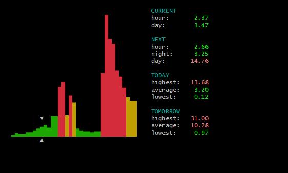
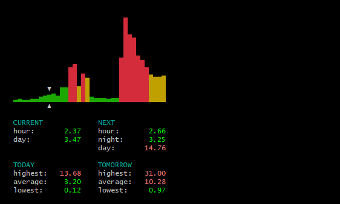
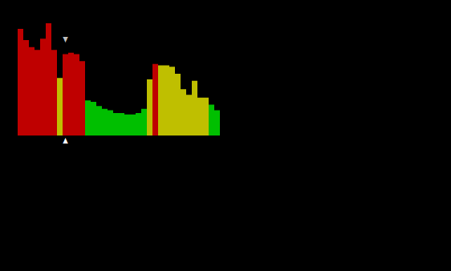

# pricedisplay

Terminal Display for the Finnish Power Price

## Building

You can install the dependencies and build the package with Poetry:

`poetry install`

`poetry build`

You can test the build with:

`poetry run python -m pricedisplay`

## Installing

Install the package from PyPI:

`python -m pip install pricedisplay`

Currently you need Python 3.9 or greater.

**NOTE:** On macOS you may get a warning from urllib3. The default installation of Python includes OpenSSL version compiled with LibreSSL, which is no longer supported. You can fix this by installing Python with Homebrew. For details see [this issue](https://github.com/urllib3/urllib3/issues/3020).

## Usage

Run the display with the command:

`python -m pricedisplay`

The package creates a settings file config.yml in your config path.

| OS        | Settings Location                             |
|-----------|-----------------------------------------------|
| macOS     | `~/Library/Application Support/pricedisplay/` |
| GNU/Linux | `~/.config/pricedisplay/`                     |
| Windows   | `%APPDATA%\pricedisplay\`                     |

You can also pass your own settings file as an argument:

`python -m pricedisplay --settings PATH`

## Notes

The actual display of the graph depends on your terminal font and colors. For best results you should have UTF-8 encoding and a font which includes unicode East Asian ambiguous characters (in wide format). Some tested combinations are:

| OS        | Terminal         | Font           |           
|-----------|------------------|----------------|
| macOS     | iTerm with Bash  | Hack           |
| GNU/Linux | Gnome with Bash  | Ubuntu Mono    |
| Windows   | Mintty with Bash | Lucida Console | 

## Sample outputs

